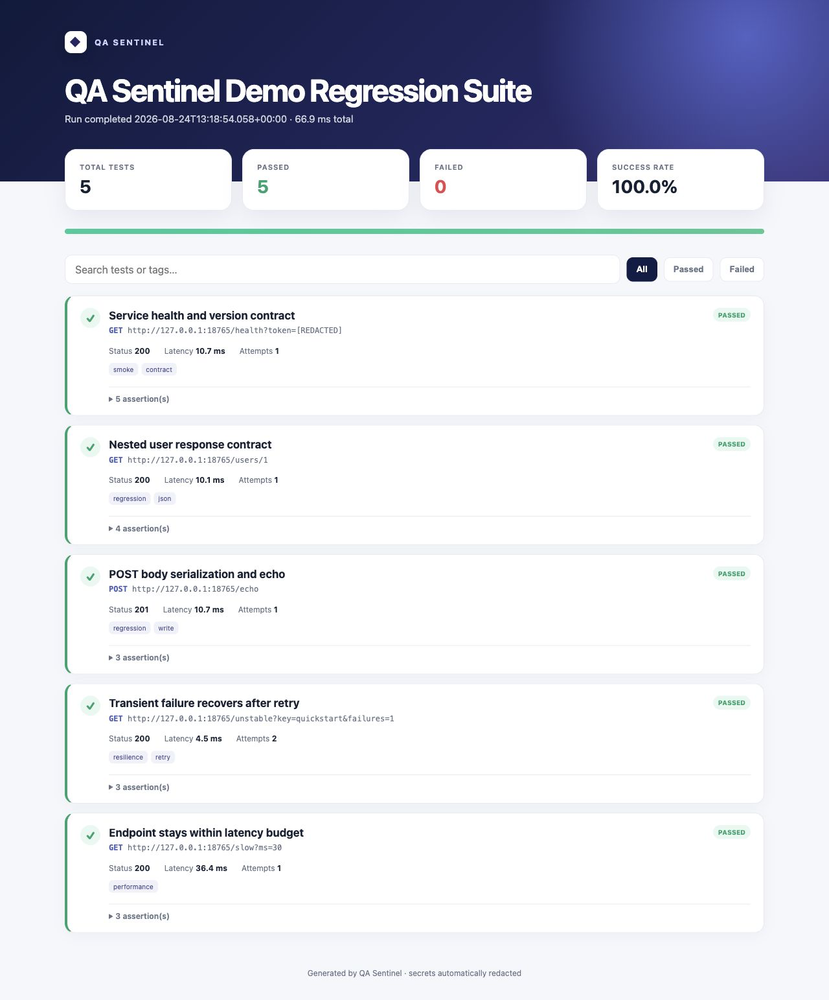

# QA Sentinel

**Run repeatable API checks from JSON and get useful terminal, HTML, JSON, and JUnit results.**

[](https://www.python.org/)
[](pyproject.toml)
[](tests/)
[](LICENSE)
[](https://github.com/T98765SREDT/qa-sentinel/actions/workflows/ci.yml)

QA Sentinel is a dependency-free Python CLI for small API regression suites. It validates response contracts, runs independent checks concurrently, retries eligible transient failures, and writes reports that are suitable for local review or CI artifacts.

[View the generated sample report](docs/sample-report.html) · [Browse the source](https://github.com/T98765SREDT/qa-sentinel) · [Review the security policy](SECURITY.md)



## Quickstart

Requires Python 3.10 or newer. No runtime packages need to be installed.

Start the deterministic demo API in one terminal:

```bash
python3 -m qa_sentinel serve-demo
```

Validate the suite without sending requests, then run its five checks in another terminal:

```bash
python3 -m qa_sentinel validate examples/demo-suite.json

python3 -m qa_sentinel run examples/demo-suite.json \
  --html qa-sentinel-report.html \
  --json qa-sentinel-report.json \
  --junit qa-sentinel-report.xml
```

A successful run prints one line per check and finishes with a summary:

```text
[PASS] Service health and version contract  status=200  latency=...ms  attempts=1
[PASS] Nested user response contract  status=200  latency=...ms  attempts=1
[PASS] POST body serialization and echo  status=201  latency=...ms  attempts=1
[PASS] Transient failure recovers after retry  status=200  latency=...ms  attempts=2
[PASS] Endpoint stays within latency budget  status=200  latency=...ms  attempts=1

QA Sentinel Demo Regression Suite: 5/5 passed (100.0%) in ...ms
```

The same run creates:

- a self-contained HTML report with search and pass/fail filters;
- structured JSON for scripts and other automation;
- optional JUnit XML for CI test-report viewers.

Open the checked-in examples: [HTML report](docs/sample-report.html) · [JSON report](docs/sample-report.json)

To install the command locally:

```bash
python3 -m pip install -e .
qa-sentinel validate examples/demo-suite.json
```

## What a suite can verify

| Check | Example | Result |
| --- | --- | --- |
| HTTP status | `{"type": "status", "equals": 200}` | exact status or allowed status list |
| JSON value | `{"type": "json_path", "path": "data.id", "equals": 7}` | nested objects and array indexes |
| JSON presence | `{"type": "json_path", "path": "data.email", "exists": false}` | required or intentionally absent fields |
| Header | `{"type": "header", "name": "Content-Type"}` | presence or exact value |
| Body text | `{"type": "body_contains", "value": "ready"}` | substring in decoded response text |
| Latency | `{"type": "latency", "max_ms": 750}` | response stays within a budget |

Configuration and assertion shapes are validated before the first network request. Invalid configuration exits with code `2` instead of producing a partial run.

## Suite format

```json
{
  "name": "Production smoke suite",
  "workers": 4,
  "variables": {
    "base_url": "https://api.example.com",
    "api_token": "${API_TOKEN}"
  },
  "defaults": {
    "timeout_seconds": 5,
    "retries": 2,
    "retry_delay_seconds": 0.25,
    "retry_on_status": [429, 500, 502, 503, 504],
    "headers": {
      "Authorization": "Bearer {{api_token}}"
    }
  },
  "tests": [
    {
      "name": "Current user contract",
      "method": "GET",
      "url": "{{base_url}}/v1/me",
      "tags": ["smoke", "contract"],
      "assertions": [
        {"type": "status", "equals": 200},
        {"type": "json_path", "path": "data.id", "exists": true},
        {"type": "json_path", "path": "data.plan", "equals": "pro"},
        {"type": "latency", "max_ms": 750}
      ]
    }
  ]
}
```

Variables use `{{name}}`; environment values use `${NAME}`. Non-secret values can be replaced from the command line:

```bash
python3 -m qa_sentinel run suite.json \
  --var base_url=https://staging.example.com
```

Use environment variables for credentials. Missing environment variables are rejected during validation.

## Reliability and safety boundaries

- Tests run in parallel while reports retain the order declared in the suite.
- Transport errors and configured transient statuses can be retried with exponential backoff.
- Automatic retries apply only to idempotent methods by default. A non-idempotent request requires `"retry_non_idempotent": true` to opt in.
- Retries are limited to five; each backoff delay is capped at 30 seconds.
- URLs require an HTTP or HTTPS scheme and a hostname. Embedded URL usernames and passwords are rejected.
- HTTPS-to-HTTP redirect downgrades are blocked. Authorization, cookies, API keys, and similar headers are removed on cross-origin redirects.
- Resolved environment secrets and credential-shaped values are redacted from terminal output, assertion diagnostics, HTML, JSON, and JUnit reports.
- CLI exit codes are stable: `0` for a passing suite, `1` for failed checks, and `2` for invalid configuration.

Redaction is defense in depth, not credential storage. See [SECURITY.md](SECURITY.md) for the supported boundary.

## Architecture

```text
JSON suite
   │
   ▼
config.py ── interpolation, validation, normalization
   │
   ▼
runner.py ── bounded thread pool, declaration-order results
   │
   ├── http_client.py ── HTTP transport, redirects, retries, timeouts
   └── assertions.py  ── response contract evaluation
   │
   ▼
redact.py ── credential removal at the output boundary
   │
   ├── reporting.py ── HTML, JSON, and JUnit XML
   └── cli.py       ── commands, terminal output, exit codes
```

Immutable dataclasses carry normalized test cases and results between the transport, assertion, orchestration, and reporting layers. Report formatting does not determine whether a test passes.

## Verification

Run all 43 unit and integration tests:

```bash
python3 -m unittest discover -s tests -v
```

Check that every Python source file compiles:

```bash
python3 -m compileall -q qa_sentinel tests examples
```

The test suite covers configuration validation, JSON paths, core assertion evaluation, deterministic concurrency, retry eligibility and caps, redirect policy, report generation, JUnit counts, CLI exit behavior, and secret removal. Integration tests bind the demo API to an ephemeral local port. CI runs the checks defined in [`.github/workflows/ci.yml`](.github/workflows/ci.yml).

## Project layout

```text
qa_sentinel/          CLI, configuration, transport, assertions, runner, reports
tests/                unit and integration tests
examples/             deterministic demo suite and server entry point
docs/                 generated HTML/JSON report examples and screenshot
.github/workflows/    test and Pages workflows
```

## Current scope and limitations

- Designed for small functional and regression suites, not load or performance testing.
- Does not run browser checks, execute arbitrary scripts, or chain values from one response into later requests.
- JSON assertions support the documented dot-and-index path syntax; this is not a full JSONPath implementation.
- The standard-library transport keeps installation simple but does not expose the connection pooling and timeout controls of a dedicated HTTP client.
- Redaction recognizes configured secrets and common credential shapes, but reports should still be handled as potentially sensitive CI artifacts.

## Contributing and releases

[CONTRIBUTING.md](CONTRIBUTING.md) contains the local verification checklist. User-visible changes are recorded in [CHANGELOG.md](CHANGELOG.md).

## License

[MIT](LICENSE)
